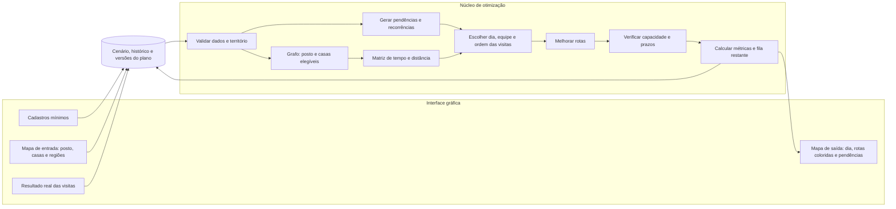

# Plano de desenvolvimento — planejamento de visitas domiciliares

## 1. Propósito e recorte

Construir e avaliar um **artefato de pesquisa reutilizável** que receba os dados de uma unidade de saúde, seu território, as equipes disponíveis e as necessidades de acompanhamento de pacientes, e produza rotas para os **próximos N dias de trabalho**. O planejamento deve atender prioritariamente às visitas pendentes e reduzir o custo de deslocamento, respeitando a capacidade diária de cada equipe. Ao registrar o resultado real de uma visita, o sistema atualiza as pendências e recalcula a janela futura.

O contexto é o desafio do Ciclo 2 de INF99003, descrito em [INF99003-Ciclo_2_relatorio.md](INF99003-Ciclo_2_relatorio.md). Neste recorte, uma **equipe** reúne um médico, um enfermeiro e um assistente social, que percorrem juntos uma rota diária. O protótipo terá um núcleo de planejamento e uma **interface gráfica mínima** com cadastros, mapa para marcar posto/casas/regiões, visualização das rotas e registro dos resultados das visitas. Os experimentos usarão dados sintéticos e deverão ser reproduzíveis sem interação com a interface. Integração com prontuários e uso operacional no SUS ficam fora do escopo desta pesquisa.

**Pergunta de pesquisa:** em instâncias representativas de visitas domiciliares e falhas de atendimento, quanto uma heurística para uma janela móvel de N dias melhora o atendimento das pendências, o atraso acumulado, o deslocamento e o tempo de execução em relação a regras simples de planejamento?

**Hipótese a testar:** uma seleção orientada por urgência e prazos futuros, seguida de inserção de menor custo e melhoria local, reduz o atraso acumulado após replanejamentos sem elevar excessivamente o deslocamento ou o tempo computacional. Isso é uma hipótese experimental, não um resultado presumido.

## 2. Entrada, saída e significado dos dados

| Entidade | Campos mínimos | Observações |
| --- | --- | --- |
| Posto de saúde | identificador, nome curto, coordenadas | Ponto de partida e chegada de todas as rotas; posição marcada no mapa. Cada cenário seleciona um posto. |
| Região de atuação | um ou mais polígonos desenhados no mapa | Delimita os pacientes elegíveis; polígonos devem ser válidos e a regra de borda deve ser documentada. |
| Equipe | identificador, médico, enfermeiro, assistente social, disponibilidade, horário de início e tempo disponível em cada dia | Os três integrantes se deslocam juntos; uma equipe executa uma rota por dia e pode estar indisponível em parte da janela. Nomes dos integrantes podem ser pseudônimos no experimento. |
| Paciente | identificador pseudônimo, coordenadas da casa, última visita efetivamente concluída por condição, condições acompanhadas, duração estimada da visita | Casa marcada como nó no mapa; no máximo uma visita por paciente por dia. |
| Condição | identificador, intervalo máximo entre visitas em dias, prioridade clínica parametrizável | Os intervalos e prioridades são **parâmetros de entrada**, definidos por especialistas ou pelo cenário experimental; o software não os prescreve. |
| Deslocamento | tempo e/ou distância entre unidade e pacientes e entre pacientes | Matriz calculada previamente; a origem do custo deve ser registrada. |
| Janela de planejamento | data inicial, `N ≥ 1` dias de trabalho, calendário, antecipação máxima `A ≥ 0` dias e parâmetros da execução | A janela avança quando o dia é encerrado; dias sem expediente não contam como capacidade. `A` limita quão cedo uma visita futura pode ser programada. |
| Resultado de visita | paciente, data, estado `concluída` ou `não realizada`, motivo opcional | Só a conclusão altera a data da última visita; tentativas não realizadas permanecem no histórico. |

**Saída principal: o mapa.** Ao selecionar um dia, ele mostra o posto, os nós das casas e **todas as rotas diárias**, uma cor estável por equipe, cada qual no formato `posto → casas em ordem de visita → posto`. Setas ou números indicam a ordem; legenda associa cor, equipe e duração. A lista auxiliar mostra horários estimados, deslocamentos, fila de visitas ainda não programadas e motivo quando conhecido. Salvar versão do plano, entradas, parâmetros e histórico de resultados para reconstruir cada replanejamento.

**Regra temporal inicial:** para cada condição de um paciente, a data-limite é `última visita concluída + intervalo`, contado em **dias corridos**; os `N` dias da janela são **dias de trabalho**. A menor data-limite determina sua próxima visita. Em cada dia, classificar a visita como `vencida` (data-limite anterior ao dia), `vence hoje` ou `futura`. Para pacientes sem visita anterior, a entrada deve fornecer uma data-limite inicial explícita. Uma visita pode ser agendada no máximo `A` dias corridos antes de seu prazo; após uma visita prevista, somente sua **próxima** recorrência pode ser gerada, evitando visitas repetidas sem necessidade. Uma visita apenas planejada **não** atualiza a última visita real; dentro do plano, sua data pode ser usada como hipótese para prever visitas recorrentes, marcadas como **condicionais** até a confirmação. Se a visita prevista falhar, suas recorrências condicionais são removidas e recalculadas.

**Pendência** significa uma visita cuja data-limite já chegou e ainda não foi concluída. Atraso, em dias, é `max(0, dia avaliado − data-limite)`. Se houver múltiplas condições, uma visita concluída satisfaz as condições acompanhadas naquele atendimento; essa simplificação deve ser declarada em cada experimento. Para cada condição, a próxima data-limite após conclusão usa a **data real da conclusão**. Uma visita não realizada volta à fila com o prazo original e continua acumulando atraso.

## 3. Formulação do problema

Sejam `n` pacientes elegíveis, `m` equipes, `N` dias úteis na janela, `d_ij` o custo de viagem de `i` a `j`, `s_i` a duração da visita, `H_{k,t}` o tempo disponível da equipe `k` no dia `t`, e `p_{i,t}` a prioridade baseada no prazo e em um peso clínico configurado. Para cada visita exigida ou prevista na janela, decidir **dia, equipe e posição da rota**; uma visita pode ficar sem atribuição se faltar capacidade. Uma conclusão poderá gerar outra visita do mesmo paciente ainda dentro da janela.

**Restrições obrigatórias no protótipo:**

1. Cada visita é atribuída a, no máximo, uma equipe; um paciente aparece no máximo uma vez por dia. Uma nova visita periódica só pode ocorrer após a visita anterior prevista ou concluída e dentro do limite de antecipação `A`, conforme o estado do plano.
2. Cada rota diária da equipe completa começa e termina no **mesmo posto de saúde**, mesmo quando nenhuma visita couber na jornada; nesse caso, a rota é vazia e não precisa de traçado.
3. Para cada equipe e dia, `tempo de deslocamento + soma das durações das visitas ≤ H_{k,t}`; dias indisponíveis ou sem os três integrantes têm capacidade zero. A equipe inteira visita cada casa e consome uma única jornada compartilhada.
4. Só entram na otimização pacientes com localização válida dentro de uma das regiões desenhadas.
5. A mesma matriz de custos, o mesmo calendário e as mesmas restrições são usados por todos os métodos comparados.
6. Visitas já concluídas ficam fixas no histórico; no primeiro protótipo, o replanejamento mantém a parte ainda não executada do dia atual e altera somente os dias futuros.

O problema combina **seleção de visitas, escolha do dia, atribuição a equipes e roteamento**. Como a capacidade pode ser insuficiente, uma solução pode deixar visitas na fila. A avaliação usa resultados separados: pendências atendidas, **dias de atraso acumulados ao longo da janela**, visitas futuras atendidas, deslocamento e distribuição de carga. Uma função experimental pode ponderar atraso, visitas concluídas e custo de viagem; os pesos devem ser explícitos e variados nos experimentos. Também serão comparadas soluções por dominância de Pareto, sem presumir um peso universal.

**Fora do modelo inicial:** janelas de horário por paciente, múltiplos postos de partida em um mesmo cenário, necessidades de profissionais diferentes por visita, meios de transporte mistos, trânsito em tempo real e integração com sistemas clínicos. As três profissões compõem a equipe inteira, mas o modelo não divide tarefas ou capacidades individuais entre elas. Essas extensões só serão incorporadas se houver tempo e dados suficientes, sem comprometer a avaliação do horizonte móvel.

## 4. Ciclo de execução e replanejamento

1. O usuário define a data inicial, `N` dias úteis, equipes e pacientes. O planejador gera uma versão do plano para toda a janela, com rotas diárias e fila de visitas sem alocação.
2. No dia de atendimento, cada visita programada recebe um resultado: `concluída` ou `não realizada` (por exemplo, ausência ou indisponibilidade). Visitas sem resultado ao encerrar o dia são tratadas como **não realizadas**, com motivo `não informado`; nunca como concluídas por presunção.
3. Uma visita concluída atualiza o histórico e os prazos das condições. Uma visita não realizada mantém a data da última conclusão e retorna à fila com seu prazo original.
4. Após registrar o resultado, criar uma **nova versão** do plano para a parte restante da janela. Ao encerrar o dia, avançar a janela para manter `N` dias úteis futuros; visitas já executadas não podem ser movidas. Uma atualização no meio do dia pode preservar a sequência restante como fixa no primeiro protótipo e recalcular os dias seguintes.
5. Recalcular todas as recorrências condicionais dependentes da visita alterada. A interface apresenta o que mudou entre versões: visita remanejada, nova pendência, prazo atualizado e rota afetada.

Exemplo: uma pessoa deveria ser atendida hoje e não foi. Ela continua vencida na fila; o plano de amanhã e dos dias seguintes é recalculado. Se ela for atendida amanhã, o próximo prazo passa a contar **a partir de amanhã**, conforme o intervalo de sua condição. O plano anterior permanece consultável para comparação.

## 5. Interface gráfica mínima

| Tela ou área | Ações mínimas | Retorno visível |
| --- | --- | --- |
| Cadastros e cenário | Criar, listar, editar e desativar postos, pacientes e equipes; definir data inicial, `N`, antecipação `A`, condições/intervalos e disponibilidade diária | Resumo de entradas e erros de validação antes de planejar. |
| Mapa de entrada | Clicar para **marcar o posto e cada casa**; desenhar, editar e remover um ou mais polígonos de atuação | Coordenadas persistidas; destaque para casas dentro/fora da região; confirmação visual das edições. |
| Mapa de saída | Gerar/recalcular plano e selecionar dia; mostrar **todas as equipes desse dia** simultaneamente | Um traçado por equipe, cada qual com cor distinta e legenda, saindo do posto e retornando a ele; casas numeradas na ordem da rota, duração, deslocamento e pendências em painel auxiliar. |
| Execução | Marcar cada visita como concluída ou não realizada; informar motivo opcional; encerrar o dia | Nova versão do planejamento e resumo das alterações para os próximos dias. |

O mapa serve para **entrada e saída**, com a visualização das rotas como tela principal após o cálculo. O posto e as casas são nós do grafo de planejamento; o usuário pode marcar e corrigir seus pontos sem editar arquivos. A cor identifica a equipe e permanece a mesma ao trocar de dia; o painel também identifica equipes por nome/legenda para não depender apenas de cor. Cada traçado liga os nós na ordem planejada. Com custo por linha reta, segmentos exibidos são aproximações; um traçado sobre ruas só deve ser mostrado quando houver geometria viária correspondente. Definir uma regra determinística para pontos na borda e impedir planejamento com região vazia ou geometria inválida.

O mini CRUD apenas mantém os três cadastros necessários ao cálculo. Cada entidade pode ser criada, consultada e editada; registros sem histórico podem ser removidos, e registros já usados em planos são desativados para preservar as versões anteriores. Mudanças em coordenadas, disponibilidade ou composição de equipe exigem nova versão do plano. Não é necessário desenvolver editor cartográfico avançado, login ou aplicação para dispositivos móveis.

## 6. Arquitetura mínima do artefato

O diagrama separa a interface do **núcleo de otimização**. A persistência guarda entradas, histórico real e versões do plano; o mapa exibe o resultado calculado e recebe resultados de execução para o próximo replanejamento.

**Como o otimizador trabalha:**

1. **Gerar demanda:** o histórico de visitas concluídas e os intervalos produzem visitas pendentes e previstas para os `N` dias. Cada candidato tem paciente, prazo, duração, urgência e eventual dependência de uma visita anterior prevista. Resultado: uma fila temporal; não há rotas ainda.
2. **Montar o grafo:** o posto e as casas elegíveis são vértices. Para o cálculo inicial, cada par de vértices recebe peso de tempo/distância em uma matriz. Esse grafo de planejamento representa **possibilidades de deslocamento**, enquanto o mapa mostra apenas as arestas escolhidas nas rotas. Se houver malha viária, ela pode fornecer os pesos e a geometria dos trajetos.
3. **Construir o plano:** a heurística escolhe quais visitas cabem, em qual dia e equipe, e sua posição na sequência. Para testar uma inserção entre `a` e `b`, calcula o acréscimo de viagem `d(a,i) + d(i,b) − d(a,b)` e soma a duração da visita. Só aceita a inserção se a jornada da equipe comportar o novo total e os prazos/recorrências permanecerem válidos. Quando falta capacidade, o paciente permanece na fila.
4. **Melhorar e verificar:** trocas como `2-opt` reduzem o deslocamento dentro das rotas; o verificador confere origem e retorno ao posto, unicidade, disponibilidade da equipe, jornada e regras temporais. Uma rota inválida não é publicada no mapa.
5. **Replanejar:** ao registrar uma visita concluída ou não realizada, recalcular prazos e candidatos a partir do histórico real, descartar recorrências condicionais afetadas e executar novamente o planejador para os dias futuros. O resultado gera nova versão e uma lista do que mudou.

Assim, **gerar candidatos**, **escolher visitas/dias/equipes**, **ordenar cada rota** e **reagir ao resultado real** são operações diferentes, com entradas e saídas próprias. A interface só envia o cenário e apresenta as rotas; a mesma lógica pode ser executada em lote nos experimentos.

| Módulo | Responsabilidade | Contrato verificável |
| --- | --- | --- |
| Interface e persistência | Manter mini CRUD e pontos/polígonos do mapa; salvar cenário, histórico e versões do plano | O cenário reabre com posto, casas, polígonos e resultados preservados. |
| Leitor/validador | Ler um cenário em formato documentado, validar datas, `N`, `A`, coordenadas, polígonos, intervalos e jornadas | Erros claros para dados inválidos; nenhuma rota produzida a partir de entrada inconsistente. |
| Estado temporal | Filtrar pela região, calcular pendências e recorrências condicionais e aplicar resultados reais | Somente visita concluída altera a última visita; replanejamento é determinístico para mesmo estado. |
| Grafo e custos | Criar vértices para posto/casas e matriz de tempo/distância; começar com distância euclidiana ou Haversine e velocidade fixa documentada | Matriz com `n + 1` pontos, incluindo o posto; diagonal zero; peso e geometria de exibição identificados separadamente. |
| Planejadores e melhoria | Implementar baselines, heurística de horizonte móvel e melhoria de rotas | Todos recebem o mesmo estado e devolvem rotas por dia/equipe no mesmo formato. |
| Verificador | Conferir unicidade, precedência temporal, origem/destino, território e limite diário de jornada | Uma solução inválida é rejeitada e apontada no relatório. |
| Avaliador e apresentação | Calcular qualidade, cobertura, custo e tempo de execução; fornecer traçados ordenados e cores para o mapa | Métricas reproduzíveis por cenário, método, parâmetros e semente; cada rota começa e termina no posto. |
| Gerador de cenários | Produzir instâncias sintéticas documentadas | Reexecução com a mesma semente produz a mesma instância. |

O núcleo deve funcionar sem a interface para permitir testes em lote. Uma matriz de deslocamento externa pode ser aceita futuramente pela mesma interface, permitindo usar rede viária sem alterar o planejador. Distância geográfica direta será tratada como **aproximação experimental**, não como estimativa fiel do trajeto urbano.

## 7. Métodos a implementar e comparar

1. **Baseline diário de urgência:** processar os dias em ordem; em cada dia, ordenar visitas disponíveis por vencimento e inserir cada uma na equipe com menor custo adicional viável. Ao simular uma conclusão prevista, gerar sua próxima visita condicional, se couber na janela. Empates seguem identificadores estáveis.
2. **Baseline diário geográfico:** processar os mesmos dias e construir cada rota pelo vizinho viável mais próximo, mantendo a mesma capacidade e as mesmas regras de recorrência.
3. **Heurística principal com antecipação:** em cada dia, pontuar visitas disponíveis usando atraso, peso configurado, proximidade do prazo dos próximos dias e custo incremental de inserção. Permitir antecipar uma visita futura quando há capacidade, mas registrar o efeito sobre as visitas vencidas e os próximos prazos previstos. Uma regra por classe de urgência deve impedir que uma visita futura de baixo peso desloque uma vencida sem justificativa explícita. Documentar função de pontuação, empates e custo incremental zero antes dos experimentos.
4. **Melhoria local:** aplicar `2-opt` dentro de cada rota para reduzir deslocamento sem alterar os dias de atendimento; testar realocação entre dias/equipes se houver tempo, respeitando prazos de recorrência, capacidade e congelamento do histórico executado.
5. **Referência exata em instâncias pequenas (opcional):** resolver uma formulação inteira ou enumerar soluções pequenas com limite de tempo, para estimar a distância das heurísticas ao melhor resultado conhecido. Resultados sem prova de ótimo devem ser identificados como limites, não como ótimo.

Todos os métodos devem produzir planos viáveis quando a capacidade é insuficiente, mantendo visitas não atendidas na fila. Reexecutar o mesmo método após um resultado real deve preservar o histórico e atualizar todos os dias futuros afetados. Casos sem paciente elegível ou sem equipe disponível geram plano vazio válido, com justificativa.

## 8. Análise de complexidade e desempenho

Usar `n` para pacientes, `m` para equipes, `N` para dias na janela e `P` para passagens de melhoria local. Pode haver até `V ≤ nN` visitas previstas na janela, pois um paciente aparece no máximo uma vez por dia. A análise abaixo considera matriz **simétrica**, consultas de custo em tempo constante e verificação incremental de capacidade, sem janelas de horário. Os limites são conservadores e serão revistos após a implementação. Se uma matriz viária assimétrica for usada, a avaliação de `2-opt` precisará ser adaptada e seu custo reanalisado.

| Etapa | Tempo assintótico esperado | Espaço esperado | Premissa |
| --- | --- | --- | --- |
| Construção da matriz completa | `O(n²)` | `O(n²)` | Cálculo de cada par de pontos uma vez. |
| Ordenação por urgência | `O(n log n)` | `O(n)` | Comparação por chave precomputada. |
| Atualização dos prazos e recorrências | `O(V)` | `O(V)` | Cada visita prevista é gerada/atualizada uma vez numa passagem cronológica. |
| Baseline diário de urgência | `O(N(n log n + n² + mn))` | `O(n² + V + Nm)` incluindo a matriz e o plano | Ordenação e menor inserção viável para até `n` pacientes por dia. |
| Baseline diário geográfico | `O(Nmn²)` como limite superior | `O(n² + V + Nm)` | Varredura direta de candidatos por dia e equipe. |
| Heurística diária com reavaliação global de candidatos | `O(Nmn³)` como limite superior simples | `O(n² + V + Nm)` | Até `n` escolhas por dia; cada escolha pode examinar pacientes, equipes e posições. |
| `2-opt` com `P` passagens por dia | `O(NPn²)` | `O(n² + V + Nm)` | Avaliação incremental de cada troca; `P` limitado por parâmetro. |
| Replanejamento completo após `R` eventos | `O(R × T_plano)` | `O(n² + V + Nm + R V)` se todas as versões forem mantidas em memória | `T_plano` é o custo do método escolhido; salvar versões em arquivo evita mantê-las todas em memória. |

Esses limites são da **implementação proposta**, não garantias universais das técnicas. A atualização geométrica de regiões e o custo de obter uma matriz por serviço de mapas devem ser medidos separadamente. Medir preparação, primeira geração e cada replanejamento, além de memória máxima. Variar `n`, `m`, `N` e número de eventos para observar se o tempo empírico acompanha a análise. Estabelecer orçamento de tempo por execução e reportar o melhor plano válido encontrado até o limite.

## 9. Dados, experimentos e validade

**Dados iniciais:** cenários sintéticos com coordenadas e polígonos de atuação, unidade, calendário e disponibilidade de equipes, condições, datas de última visita, durações de visita e sementes aleatórias. Gerar também eventos de conclusão e de visita não realizada, com taxas controladas. Não usar dados identificáveis de pacientes nesta etapa. Guardar configuração, semente e sequência de eventos de cada cenário.

**Cenários necessários:**

- Capacidade folgada, equilibrada e insuficiente.
- Pacientes próximos e espalhados; grupos geográficos separados.
- Poucas e muitas visitas vencidas, com diferentes graus de atraso.
- Equipes com jornadas iguais e diferentes.
- Horizontes curtos e longos; periodicidade que produz mais de uma visita na janela; falhas isoladas e sucessivas no atendimento.
- Casos limite: zero equipes, zero pacientes, apenas um paciente, paciente fora dos polígonos, posto não marcado, região vazia ou inválida, condição múltipla, dado inválido, visita individual maior que qualquer jornada e tentativa não realizada no último dia da janela.

**Protocolo:** executar todos os métodos nas mesmas instâncias, com o mesmo calendário, limite de tempo e sequência de resultados reais. Variar `n`, `m`, `N`, fração de pendências, frequência de falhas e pesos da função de pontuação. Para simular a execução, fixar previamente o resultado de cada tentativa por paciente e data, de modo que métodos diferentes encontrem o mesmo evento quando programarem a mesma visita. Repetir cenários aleatórios com sementes registradas. Comparar medianas e dispersão, apresentar resultados por cenário e verificar todos os planos antes de comparar métricas.

**Métricas de qualidade:** fração de pendências efetivamente concluídas; dias de atraso acumulados por paciente/condição ao longo do horizonte; atraso remanescente no fim da janela; visitas concluídas e não realizadas; tempo/distância de deslocamento efetivo e planejado; utilização e desequilíbrio de jornada; quantidade de alterações entre versões; tempo de geração/replanejamento e memória. Separar indicadores do **plano previsto** dos resultados **efetivamente simulados**, pois uma visita agendada pode falhar. Uma melhora em custo com perda de cobertura deve aparecer claramente nos resultados.

**Ameaças à validade:** trajetos em linha reta diferem das ruas reais; duração de visitas, periodicidades e falhas simuladas podem não representar o serviço; prioridades clínicas parametrizadas não substituem decisão profissional; o horizonte finito pode empurrar pendências para além de `N` dias; instâncias sintéticas podem favorecer uma heurística específica. Discutir esses limites e executar análise de sensibilidade dos parâmetros mais relevantes. Não inferir benefício clínico a partir de métricas logísticas.

## 10. Entregáveis e ordem de trabalho

| Etapa | Trabalho | Evidência de conclusão |
| --- | --- | --- |
| 1. Especificação | Fixar formato de entrada/saída, estados de visita, calendário, geometria, restrições e métricas | Exemplo de `N` dias com falha e replanejamento calculado manualmente. |
| 2. Núcleo temporal e dados | Criar gerador, validador, estado persistente, matriz de custos e verificador de planos | Cenários reproduzíveis; prazos e versões corretos após conclusão e falha. |
| 3. Baselines e heurística | Implementar baselines diários, heurística com antecipação e `2-opt` | Planos viáveis para toda a janela; análise assintótica conferida com o código. |
| 4. Interface mínima | Implementar mini CRUD, mapa com posto/casas/polígonos, rotas coloridas por equipe e registro do resultado de visitas | Fluxo completo de cadastrar → visualizar todas as rotas de um dia saindo e voltando ao posto → registrar falha → ver plano atualizado. |
| 5. Avaliação e escrita | Fazer experimentos de escala, falhas e sensibilidade, interpretar resultados e limites | Tabelas/gráficos, parâmetros reproduzíveis, projeto/relatório final. |

O [projeto de pesquisa](projeto_de_pesquisa/projeto_de_pesquisa.md) reúne a redação acadêmica; este documento é o mapa de implementação e avaliação. As referências de APS já levantadas estão em [papers/_papers.md](papers/_papers.md). A revisão ainda precisa incluir trabalhos de roteamento de veículos, roteamento com lucros ou seleção de visitas, e planejamento de atenção domiciliar, com comparação crítica às hipóteses deste projeto.

## 11. Decisões a confirmar com o grupo

- A composição de três profissionais é fixa no modelo inicial: médico, enfermeiro e assistente social se deslocam juntos e a equipe só recebe rota quando os três estão disponíveis. Não há escalonamento individual.
- Horizonte de capacidade: jornada total inclui pausas e tempo administrativo? O modelo inicial recebe apenas o tempo efetivamente disponível para visitas e deslocamentos.
- Visitas futuras podem ocupar tempo ocioso? O modelo inicial permite dentro de `A` dias do prazo, com prioridade para pendências e registro separado do efeito sobre os próximos prazos.
- Uma condição mais grave pode alterar prioridade independentemente do atraso? O modelo aceita pesos fornecidos como entrada, sem atribuir pesos clínicos por conta própria.
- Território pode conter mais de um polígono? O modelo inicial assume **um ou mais polígonos**, com inclusão do ponto na borda e união das áreas. Não usa lista paralela de elegibilidade.
- Qual custo principal será medido: tempo ou distância? Para respeitar jornada, **tempo** é obrigatório; distância pode ser métrica adicional.
- O replanejamento deve alterar a rota ainda não executada do dia atual? O modelo inicial a mantém fixa e recalcula os dias futuros; essa hipótese será mostrada na interface.

Essas decisões devem ser registradas antes de congelar o protocolo experimental, pois mudam a interpretação dos resultados.
